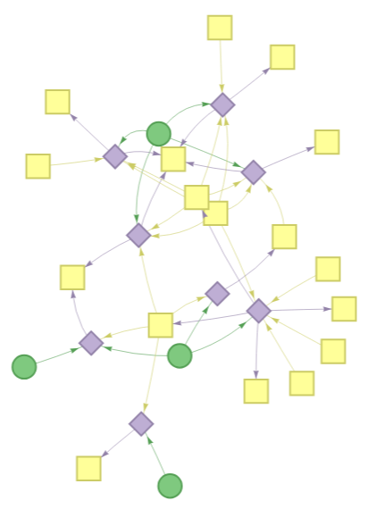

# Knowledge graphs of KEGG pathways

<p align="center"></p>

This project includes scripts for building [RDF](https://en.wikipedia.org/wiki/Resource_Description_Framework) knowledge graphs and visualizing pathways from the KEGG database. You can visualize one pathway graph at the time, or combine pathways from two different species to see their overlap.


## Installation

First, clone this repo and enter the directory. I recommend using the option `--depth=1` to only copy the current version of the files.

```bash
git clone --depth=1 https://github.com/eascarrunz/pathwaykg
cd pathwaykg
```

### Option 1: Run with uv (no install needed)

[uv](https://docs.astral.sh/uv/) can run the project directly without an explicit install step — it reads `pyproject.toml` and resolves dependencies automatically. Just prepend `uv run` to the commands. For example:

```bash
uv run kgbuild -p hsa00010 > hsa00010.ttl
```

### Option 2: Install with uv

To install the project into a virtual environment managed by uv:

```bash
uv sync
```

Then run commands through uv as in **option 1**:

```bash
uv run kgbuild -p hsa00010 > hsa00010.ttl
```

### Option 3: Install with pip

```bash
pip install .
```

Then run commands directly:

```bash
kgbuild -p hsa00010 > hsa00010.ttl
```

## Building knowledge graphs

To build a knowledge graph you only need to provide the option `-p` with a KEGG pathway entry corresponding to some organism. Entries are IDs made out of a three-letter organism code plus a 5 digit pathway code.

For instance, "hsa00010" is the entry for the _**H**omo **sa**piens_ glycolysis/gluconeogenesis pathway. The knowledge graph is built with this command:

```bash
kgbuild -p hsa00010 > hsa00010.ttl
```

This fetches pathway topology (KGML), gene records, reaction equations, and compound metadata from the KEGG REST API, then assembles them into an RDF graph in Turtle ("ttl") format.

KEGG has webpages listing the [organism codes](https://www.genome.jp/kegg/tables/br08606.html) and [pathway codes](https://www.genome.jp/kegg/pathway.html) available. Not all organisms have all the possible pathways. Reference pathways with entries starting with "map" and "ko" are **not** supported.

### Graph structure

The knowledge graph contains the following node types and relationships:

- **Gene** nodes with KEGG IDs, labels, UniProt cross-references, and KO/EC annotations
- **KO Term** nodes [(KEGG Orthologs)](https://www.genome.jp/kegg/ko.html) linking genes to their functional roles
- **Reaction** nodes with directional equations, EC numbers, and substrate/product relationships
- **Compound** nodes with names, linked as substrates and products of reactions

Genes are linked to reactions via `catalyzes` triples derived from KEGG's pathway topology (KGML), ensuring that only pathway-specific reactions are included.

Note that the substrates and products are simply defined by the script as the left-hand and right-hand compounds in the KEGG reaction equation.


## Visualization

Generate an interactive HTML visualization from a Turtle file. Here, glycolysis/gluconeogenesis in _Homo sapiens_.

```bash
visualize -i hsa00010.ttl > hsa00010.html
```

The visualization is an abstracted representation of the metabolic network based on KO terms. Individual genes are not shown — they are aggregated under their [**KO (KEGG Orthology) terms**](https://www.genome.jp/kegg/ko.html), representing conserved functional roles rather than specific gene loci. KO nodes connect to reaction nodes, which connect to compound nodes, tracing how enzymatic steps transform metabolites through the pathway.

Nodes types have different colours and shapes, and display metadata on hover.
- **○ "Enzyme group" nodes**: represent a functional ortholog group of enzymes sharing the same KO term. The hover tooltip shows the KO description, how many organism-specific genes map to that KO, and their KEGG gene IDs.
- **◇ Reaction nodes**: represent a biochemical reaction from the KEGG Reactions database. Labeled with the reaction definition (equation).
- **□ Compound nodes**: metabolites that participate as substrates or products. Labeled with the compound name.

You can zoom in and out on the graph to display or hide text labels on nodes and edges.

### Pathway comparison mode

You can use the visualization tool to compare pathways across species. You just need to provide two Turtle files to visualize their overlap. Here, glycolysis/gluconeogenesis in _Homo sapiens_ (hsa00010) and _Escherichia coli_ (eco00010).

```bash
visualize -i hsa00010.ttl eco00010.ttl > hsa-eco-00010.html
```

Nodes are colored by provenance instead of type: shared nodes (present in both organisms) are distinguished from nodes unique to each organism.

-  **Teal**: nodes unique to the first organism
-  **Orange**: nodes unique to the second organism
-  **Purple**: nodes present in both graphs

Since KO terms, reactions, and compounds use organism-independent KEGG identifiers, this reveals evolutionary conservation and divergence at the functional level — which enzymatic steps are conserved and which are lineage-specific.
